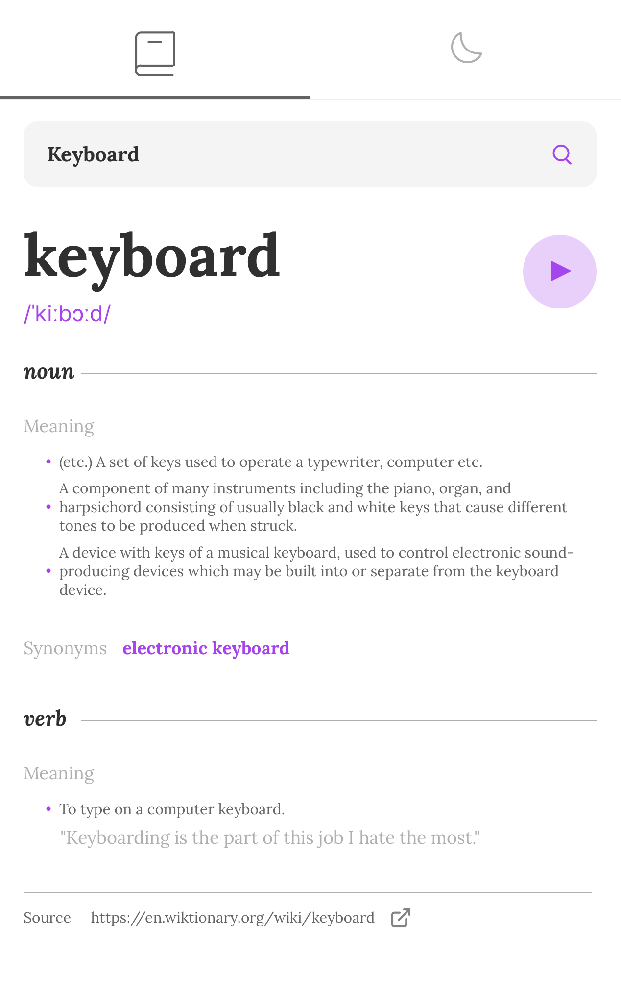
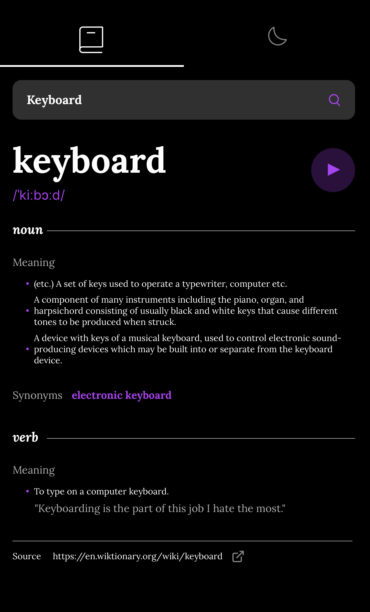

# Dictionary App
A simple Dictionary application simulated on an iPhone 14 Pro Max developed as part of a Mobile Application Development Course through Western Washington University.

   

<!-- TABLE OF CONTENTS -->

  
Table of Contents

  <ol>
    <li><a href="#Code-Base">Code Base</a></li>
    <li><a href="#Application">Application</a></li>
    <ul>
        <li><a href="#Functionality">Functionality</a></li>
        <li><a href="#Design">Design</a></li>
    </ul>
    <li><a href="#Contributors">Contributors</a></li>
    <li><a href="#Thank-You">Thank You!</a></li>
  </ol>

## Code base

Instead of starting from scratch, a code base has been generated for this application. The code base is generated by ChatGPT.

## Application 
Developed a Dictionary application using React Native and Expo. Below is the simulated Dictionary application on an iPhone 14 Pro Max using both light and dark themes:

Light Theme:

Dark Theme: 

### Functionality

Words and definitions are all generated from the Free Dictionary API: https://dictionaryapi.dev/. 

Users are able to:

* Search for words using the input field
* See the Free Dictionary API's response for the searched word
* See a form validation message when trying to submit a blank form
* Play the audio file for a word when it's available
* Switch between light and dark themes
* View the optimal layout for the interface depending on their device's screen size
* See hover and focus states for all interactive elements on the page

Please note:

* The API will sometimes return multiple items for a word, phonetics, and audio file. To remedy this, the application will display all definitions and use one audio file as its main source for audio.

In addition to the above operations, test cases have been implemented to cover most components and most possible user interactions. 

### Design

The home screen loads a word and its definitions and pronunciation as a demo for users (e.g., keyword). In addition, theme selection is its own screen that can be navigated to using the applications root navigation:

* One screen is for the Home Screen of the application 
(word generation)
* The other screen will be for users to change the theme 
(theme selection)

Users of this app are able to navigate freely among each screen.

## Contributors 
Group members who contributed to this project as part of a mobile application development course at Western Washington University.

## Thank You!
Enjoy this Dictionary Application! 
